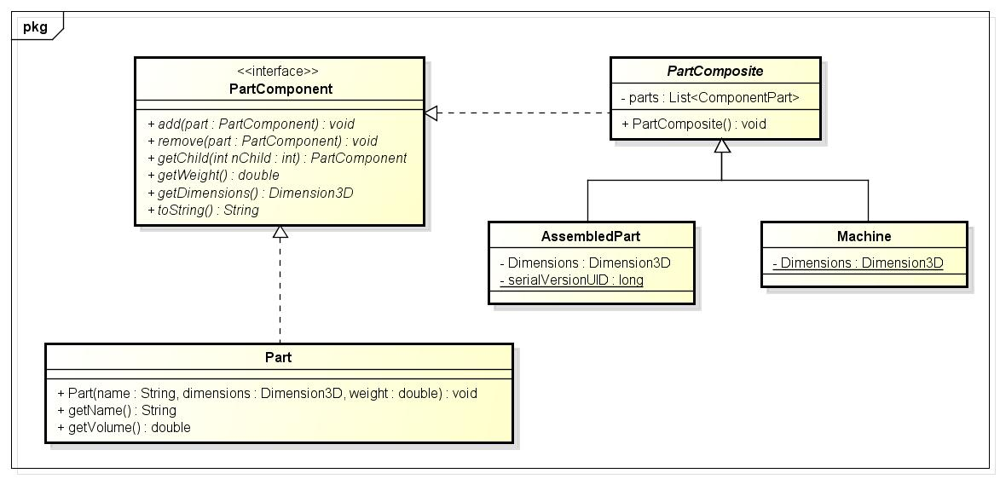
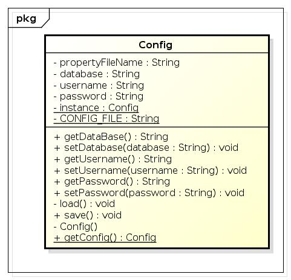

# TP1 - Rapport

## Composite
### Identification
Les classes `Machine`, `AssembledPart` et `Part` ont été identifiées comme celles faisant partie du design Composite. Puisqu'une `Part` (Pièce) ne peut pas avoir de "sous-pièce" nous en avons conclu que cette classe correspond à une feuille, ou Component, et que `Machine` (Machine) et `AssembledPart` (Pièce assemblée) correspondent aux Composites.

### Réalisation
Pour réaliser ce design pattern nous avons créé une interface pour le Component appelée `ComponentPart`. Cette interface implémente par défaut les fonctions d'ajout/suppression/accès aux enfants en lançant une erreur, celà permet de ne pas devoir ajouter du code dans la classe feuille, `part`. Nous avons également ajouté toutes les fonctions communes à toutes les classes, mais sans fournir de code.

```java
public interface PartComponent {

 public default void add(PartComponent partComponent) throws Exception {
  throw new Exception("Can't add a child in a leaf");
 }

 public default void remove(PartComponent partComponent) throws Exception {
  throw new Exception("Can't remove in a leaf");
 }

 public default PartComponent getChild(int nChild) throws Exception {
  throw new Exception("It's a leaf!");
 }

 public double getWeight();

 public Dimension3D getDimensions();

 public String toString();

}
```

Pour le composite nous avons créé une classe abstraite `CompositePart` qui implémente `Serializabe` et `PartComponent`. Les fonctions d'ajout/suppression/accès d'enfant sont implémentées. Les enfants sont gérés avec une `LinkedList<PartComponent>` et les fonctions communes à `Machine` et `AssembledPart` sont implémentées directement dans la classe abstraite. L'interface `Serializable` est indispensable afin de pouvoir sauvegarder un objet `Machine` ou `AssembledPart` dans un fichier binaire.

```java
public abstract class PartComposite implements Serializable, PartComponent {

 public PartComposite() {
  parts = new LinkedList<PartComponent>();
 }

 @Override
 public void add(PartComponent partComponent) throws Exception {
  this.parts.add(partComponent);
 }

 @Override
 public void remove(PartComponent partComponent) throws Exception {
  this.parts.remove(partComponent);
 }

 @Override
 public PartComponent getChild(int nChild) throws Exception {
  if (parts.size() < nChild) {
   throw new IndexOutOfBoundsException("nChild is too big");
  }

  return parts.get(nChild);
 }

 int getNumberOfElements() {
  return this.parts.size();
 }

 public double getWeight() {
  double w = 0;
  for (PartComponent p : parts)
   w += p.getWeight();
  return w;
 }

 protected List<PartComponent> parts;
}
```


### Conclusion
En conclusion le pattern composite est très utile lorsque l'on a besoin de travailler en polymorphisme et qu'on ne sait pas exactement quel objet est en cours de traitement.

Cependant il faut quand même faire attention lorsque l'on manipule des enfants qui, eux, implémentent des fonctions qui ne font "rien".

#### Diagramme de classe



## Singleton
### Identification
Nous avons identifié la classe `Config` comme la classe à transformer en singleton. Il parait logique que notre application ne puisse avoir qu'une seule instance de cet objet. Les autres classes n'auraient pas de sens en singleton.

### Implémentation
Pour transformer cette classe en singleton, voici les changements que nous avons effectué :

```java
// Constructeur privé afin de ne pas pouvoir le créer
// autrement que par "getConfig()"
private Config() {
   this.propertyFileName = CONFIG_FILE;
   load();
}

// Function statique permettant de créer une instance de Config si elle
// n'est pas encore existante
public static Config getConfig() {
   if (Config.instance == null) {
      Config.instance = new Config();
   }
   return Config.instance;
}

// Instance unique de notre classe "Config"
// De plus, on stocke le nom du fichier sous forme de constante
private static Config instance = null;
private static final String CONFIG_FILE = "config.properties";
```

De plus, il n'est pas possible de définir le nom de fichier dans la méthode `getConfig()`, car cela n'aurait pas de sens. Une fois la première instance créée avec un certain nom de fichier, le prochain appel ne prendrait pas en compte un nouveau nom de fichier. C'est pourquoi nous avons décidé de mettre un nom de fichier en static. Et également l'application dans son état initial n'a aucun appel au constructeur avec un nom de fichier spécifié

Nous aurions pu implémenter le singleton en utilisant un énuméré, mais n'avons pas choisi cette solution, car dans le cas où nous ne faisons pas appel à cette instance, celle-ci est créée pour rien. Ce problème est encore plus flagrant dans le cas ou nous avons plus qu'une instance.


### Conclusion
Ce pattern nous permet de nous assurer qu'une seule et unique instance sera disponible. De plus, cette façon de faire permet d'avoir accès à l'instance à partir de n'importe quel endroit du code (un genre de variable global en somme).
C'est d'ailleurs pour cette dernière raison que certains programmeurs ne sont pas très enthousiastes concernant ce patron de conception.

En conclusion, nous pensons que ce patron de conception peut être bien utile. Cependant il faut l'utiliser avec parcimonie et avoir de bonnes raisons pour l'utiliser.

#### Diagramme de classe


