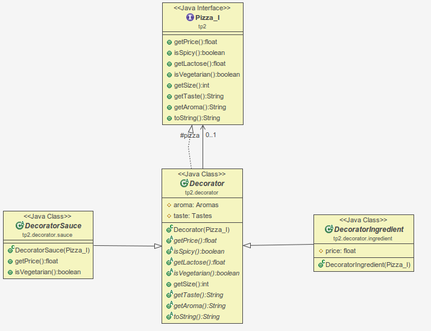
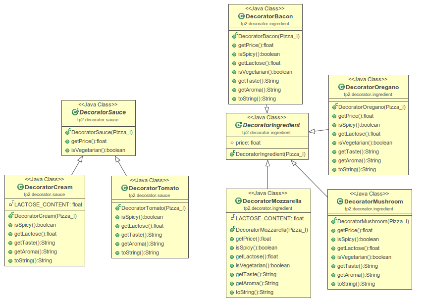
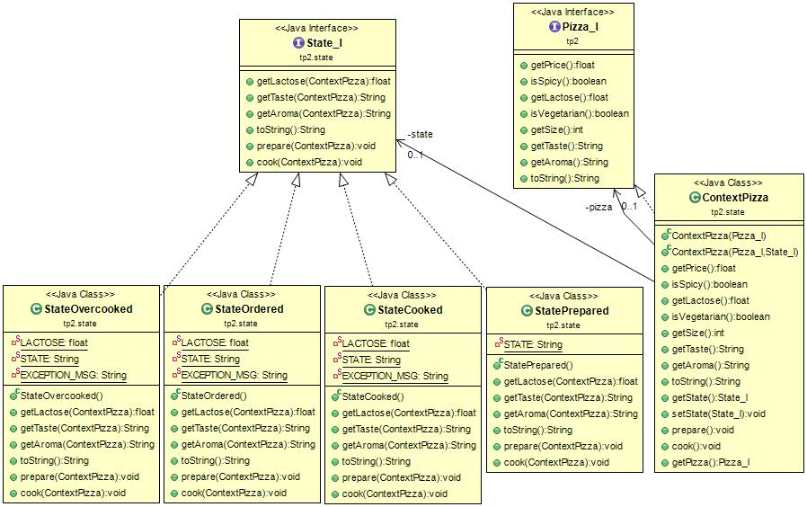

# TP2 - Rapport

## Introduction

Pour ce Travail Pratique, il a été demandé de développé un programme de création de pizza en utilisant les patterns Decorator, Builder et State.

Toutes les classes implémentent l'interface `Pizza_I`. Et les 3 patterns sont implémentés dans leur package respectif.


Toutes les classes propres aux patterns on été préfixées par le nom de celui-ci afin d'identifier plus facilement quel pattern est utilisé.

## Decorator

Decorator est un pattern qui permet d'ajouter un fonctionnement à un objet de base.

### Réalisation

Les decorators représentent les ingrédients et la sauce sur la pizza. Nous avons donc créer une classe abstraite, `Decorator` qui représentent tous les ingrédients et nous avons fait deux classes qui hérite de `Decorator`, `DecoratorSauce` et `DecoratorIngredient`. Ces décorateurs sont séparés car ils ont un comportement différent. La sauce ne va jamais modifier le prix, car faisant parti de l'offre de base, contrairement aux ingrédients. Ces deux classes permettent également de faire de la généralisation et donc de séparer les sauces des ingrédients rajoutés.

Les décorateurs ont également un énuméré `Aromas` et `Tastes`, qui va permettre de concatener facilement les différents types de goût et arômes de chaque ingrédient/sauce.

#### Ingrédients

Ensuite nous avons ajouté plusieurs ingrédients qui héritent de `DecoratorIngredient`, `DecoratorBacon`, `DecoratorHam`, `DecoratorMozzarella`, `DecoratorOregano`, `DecoratorPepper` et `DecoratorPepperoni`. Tous ces ingrédients redéfinissent les fonctions de l'interface `Pizza_I` et auront chacun leur propre prix.





##### Exemple de code

```java
public class DecoratorMushroom extends DecoratorIngredient {

public DecoratorMushroom(Pizza_I pizza) {
  super(pizza);
  this.taste = Tastes.NOT_GOOD;
  this.aroma = Aromas.SAVOURY;
  this.price = 0.001f;
}

@Override
public float getPrice() {
  return this.pizza.getPrice()+ this.price * (float)this.pizza.getSize();
}

@Override
public boolean isSpicy() {
  return this.pizza.isSpicy();
}

@Override
public float getLactose() throws Exception {
  return this.pizza.getLactose();
}

@Override
public boolean isVegetarian() {
  return this.pizza.isVegetarian();
}

@Override
public String getTaste() throws Exception {
  return this.pizza.getTaste() + this.taste.toString();
}

@Override
public String getAroma() throws Exception {
  return this.pizza.getAroma() + this.aroma.toString();
}

@Override
public String toString() {
  return this.pizza.toString() + " mushroom";
}


}
```

#### Sauce

Les sauces, `DecoratorCream` et `DecoratorTomato` implémentent `DecoratorSauce`, comme énoncé précédemment. Elles n'ont pas de prix et donc la fonction de renvoi de prix est directement implémenté dans la fonction `DecoratorSauce`.

##### Exemple de code

```java
public class DecoratorTomato extends DecoratorSauce {

	public DecoratorTomato(Pizza_I pizza) {
		super(pizza);
		this.aroma = Aromas.SAVOURY;
		this.taste = Tastes.GOOD;
	}

	@Override
	public boolean isSpicy() {
		return this.pizza.isSpicy();
	}

	@Override
	public float getLactose() throws Exception {
		return this.pizza.getLactose();
	}

	@Override
	public String getTaste() throws Exception {
		return this.pizza.getTaste() + this.taste.toString();
	}

	@Override
	public String getAroma() throws Exception {
		return this.pizza.getAroma() + this.aroma.toString();
	}

	@Override
	public String toString() {
		return this.pizza.toString() + " tomato sauce";
	}
}
```
#### Diagramme de classe


Pour des raisons de lisibilité, tous les decorator `DecoratorIngredient` ne sont pas représentés

## Builder
Le patron de conception `Builder` permet de créer une variété d'objets complexes à partir d'un objet source nommé `PizzaBuilder`.

### Réalisation
Ce pattern est constitué en premier d'une interface `PizzaBuilder_I` et d'une classe `PizzaBuilder` qui représente une implémentation concrète du Builder. Nous avons également développé un *director* nommé `PizzaDirector` comme dans la version standard du pattern qui va s'occuper de cacher la complexité du Builder mais celui-ci n'est pas indispensable dans notre cas d'utilisation.

Le code qui suit utilise les templates et les classes de Java. Par exemple, pour la fonction `setThickness(Class<? extends PizzaBase>)`, l'utilisateur doit founir une classe qui implémente la class `PizzaBase`. Pour pouvoir passer une classe en paramètre d'une classe propre, il suffit de faire: `PizzaThin.class();`.

L'interface `Pizza_I` contient les méthodes suivantes:
```Java
public interface PizzaBuilder_I {
	public void setThickness(Class<? extends PizzaBase> pizza);

	public void sauce(Class<? extends DecoratorSauce> sauce);

	public void addIngredient(Class<? extends DecoratorIngredient> ingredient);

	public void setSize(int radius);

	public Pizza_I getPizza();
}

```

Finalement, voici l'implémentation de la class principale PizzaBuilder,

```Java
public class PizzaBuilder implements PizzaBuilder_I {

	public PizzaBuilder() {
		this.listIngredient = new ArrayList<Class<? extends DecoratorIngredient>>();
	}

	@Override
	public void setThickness(Class<? extends PizzaBase> pizza) {
		this.pizza = pizza;
	}

	@Override
	public void sauce(Class<? extends DecoratorSauce> sauce) {
		this.sauce = sauce;
	}

	@Override
	public void addIngredient(Class<? extends DecoratorIngredient> ingredient) {
		if (!listIngredient.contains(ingredient)) {
			this.listIngredient.add(ingredient);
		}
	}

	@Override
	public void setSize(int radius) {
		this.radius = radius;
	}

	@Override
	public Pizza_I getPizza() {
		// Build
		Pizza_I newPizza = null;
		try {
			// Création de la pizza
			newPizza = (Pizza_I) pizza.getConstructor(int.class).newInstance(this.radius);

			// Ajout de la sauce
			newPizza = (Pizza_I) sauce.getConstructor(Pizza_I.class).newInstance(newPizza);

			// Ajout des ingrédients
			for (Class<? extends DecoratorIngredient> ingredient : listIngredient) {
				newPizza = (Pizza_I) ingredient.getConstructor(Pizza_I.class).newInstance(newPizza);
			}

		} catch (InstantiationException | IllegalAccessException | IllegalArgumentException | InvocationTargetException
				| NoSuchMethodException | SecurityException e1) {
			// TODO Auto-generated catch block
			e1.printStackTrace();
		}
		return newPizza;
	}

	// Input
	int radius;
	Class<? extends PizzaBase> pizza;
	Class<? extends DecoratorSauce> sauce;
	List<Class<? extends DecoratorIngredient>> listIngredient;
}

```

Notre code nous permet de créer des Builder préconfiguré pour certaines sortes de Pizza, comme par exemple:
```java
public class PizzaBuilderDiavola extends PizzaBuilder {

	public PizzaBuilderDiavola() {
		super();
		this.setSize(18);
		this.setThickness(PizzaThick.class);
		this.sauce(DecoratorTomato.class);
		this.addIngredient(DecoratorMozzarella.class);
		this.addIngredient(DecoratorPepperoni.class);
		this.addIngredient(DecoratorPepper.class);
	}
}

```

Toutes les fonctions du builder sont disponible et il est ainsi possible de modifier le builder, lui rajouter des ingrédients, modifier sa taille, ...

Notre implémentation nous permet de retourner une nouvelle pizza à chaque appel de la fonction `getPizza`, certaines variantes de ce pattern fonctionnent différemment et nécessitent de rappeler les fonctions de constructions avant chaque nouvelle pizza car autrement ils retournent la même pizza.

#### Diagramme de classe

### Conclusion


## State
Le patron de conception `State` permet de changer le comportement d'un objet selon l'état dans lequel il se trouve. Nous aurions pû mdofier directement la classe `Pizza` mais celà aurait complexifié inutilement le code.

Afin de pouvoir utiliser les contexte sur la class `Pizza` précédemment créée, nous avons créé une classe `ContextPizza` afin d'encapsuler notre objet pizza et modifier les différentes réponses des fonctions de notre objet.

### Réalisation
Pour mettre en place de ce patron, nous avons créé une interface `State_I` qui comporte toutes les méthodes relatives aux états de la pizza. Ensuite, plusieurs classes d'état ont été créées sous les noms suivants :

- `StateOrderer` : état commandé
- `StatePrepared` : état préparé
- `StateCooked` : état cuit
- `StateOvercooked` : état râté

Tous ces états effectue des tâches différentes. La classe `PizzaContext` permet d'adapter le comportement selon l'état du moment de la pizza.

#### Diagramme de class



#### Exemple de code

```java
// Interface d'état
public interface State_I {

	public float getLactose(ContextPizza pizzaContext) throws Exception;

	public String getTaste(ContextPizza pizzaContext) throws Exception;

	public String getAroma(ContextPizza pizzaContext) throws Exception;

	public String toString();

	public void prepare(ContextPizza pizzaContext) throws Exception;

	public void cook(ContextPizza pizzaContext) throws Exception;
}

// Exemple d'implémentation d'un état (état commandé)
public class StateOrdered implements State_I{

	@Override
	public float getLactose(ContextPizza pizzaContext) {
		return LACTOSE;	// Pizza is not ready ...
	}

	@Override
	public String getTaste(ContextPizza pizzaContext) {
		return Tastes.NO_TASTE.toString();
	}

	@Override
	public String getAroma(ContextPizza pizzaContext) {
		return Aromas.NO_AROMA.toString();
	}

	@Override
	public String toString()
	{
		return STATE;
	}

	@Override
	public void prepare(ContextPizza pizzaContext) throws Exception{
		pizzaContext.setState(new StatePrepared());
	}

	@Override
	public void cook(ContextPizza pizzaContext) throws Exception{
		throw new Exception(EXCEPTION_MSG);
	}

	private static float LACTOSE = 0.0f;
	private static String STATE = "state : ordered";
	private static String EXCEPTION_MSG = "Can not be cooked...";
}

// Contexte permettant d'appeler les méthodes selon l'état du moment de la pizza
public class ContextPizza implements Pizza_I{

	public ContextPizza(Pizza_I pizza) {
		this(pizza, new StateOrdered());
	}

	public ContextPizza(Pizza_I pizza, State_I state) {
		this.pizza = pizza;
		this.state = state;
	}

   // ...

	@Override
	public String getAroma() throws Exception {
		return state.getAroma(this);
	}

	@Override
	public String toString() {
		return state.toString() + " | " + pizza.toString();
	}

	public State_I getState(){
		return state;
	}

	public void setState(State_I state) {
		this.state = state;
	}

	public void prepare() throws Exception{
		state.prepare(this);
	}

	public void cook() throws Exception{
		state.cook(this);
	}

	public Pizza_I getPizza() {
		return pizza;
	}

	private Pizza_I pizza;
	private State_I state;
}
```

### Conclusion
L'objectif est atteint. A l'aide de ce patron, nous avons pu réaliser une structure de programme adéquat pour le changement de comportement de nos objets "Pizza" selon leur état.
Ce patron s'avère très pratique dans de telles situations. En effet, le code est beaucoup moins "lourd" (évite beaucoup de "if") et le programme se trouve mieux structuré.
