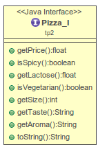

# TP2 - Rapport

## Introduction

Pour ce Travail Pratique, il a été demandé de développé un programme de création de pizza en utilisant les patterns Decorator, Builder et State.

Toutes les classes implémentent l'interface `Pizza_I`. Et les 3 patterns sont implémentés dans leur package respectif.



Toutes les classes propres ont pattern on été préfixé par le nom de celui-ci afin d'identifier plus facilement quel pattern est utilisé.

## Decorator

Decorator est un pattern qui permet d'ajouter un fonctionnement à un objet de base.

### Réalisation

Les decorators représentent les ingrédients  et la sauce sur la pizza. Nous avons donc créer une classe abstraite, `Decorator` qui représentent tous les ingrédients et nous avons fait deux classes qui hérite de `Decorator`, `DecoratorSauce` et `DecoratorIngredient`. Ces décorateurs sont séparés car ils ont un comportement différent. La sauce ne va jamais modifier le prix, car faisant parti de l'offre de base, contrairement contrairement aux ingrédients. Ceux deux classes permettent également de faire de la généralisation et donc de séparé les sauces des ingrédients rajouter.

Les décorateurs ont également un énuméré `Aromas` et `Tastes`, qui va permettre de concatené facilement les différents types de gout et arômes de chaque ingrédients / sauces.

SCHEMA INGREDIENT, SAUCE ET DECORATOR

#### Ingrédients

Ensuite nous avons ajouté plusieurs ingrédients qui héritent de `DecoratorIngredient`, `DecoratorBacon`, `DecoratorHam`, `DecoratorMozzarella`, `DecoratorOregano`, `DecoratorPepper` et `DecoratorPepperoni`. Tous ces ingrédents redéfinissent les fonctions de l'interface `Pizza_I` et auront chacun leur propre prix.

SCHEMA INGREDIENT

##### Exemple de code

```java
public class DecoratorMushroom extends DecoratorIngredient {

public DecoratorMushroom(Pizza_I pizza) {
  super(pizza);
  this.taste = Tastes.NOT_GOOD;
  this.aroma = Aromas.SAVOURY;
  this.price = 0.001f;
}

@Override
public float getPrice() {
  return this.pizza.getPrice()+ this.price * (float)this.pizza.getSize();
}

@Override
public boolean isSpicy() {
  return this.pizza.isSpicy();
}

@Override
public float getLactose() throws Exception {
  return this.pizza.getLactose();
}

@Override
public boolean isVegetarian() {
  return this.pizza.isVegetarian();
}

@Override
public String getTaste() throws Exception {
  return this.pizza.getTaste() + this.taste.toString();
}

@Override
public String getAroma() throws Exception {
  return this.pizza.getAroma() + this.aroma.toString();
}

@Override
public String toString() {
  return this.pizza.toString() + " mushroom";
}


}
```

#### Sauce

Les sauces, `DecoratorCream` et `DecoratorTomato` implémente `DecoratorSauce`, comme énoncé prédédemment. Elles n'ont pas de prix et donc la fonction de renvoie de prix est directement implémenté dans la fonction `DecoratorSauce`.

SCHEMA SAUCE

##### Exemple de code

```java
public class DecoratorTomato extends DecoratorSauce {

	public DecoratorTomato(Pizza_I pizza) {
		super(pizza);
		this.aroma = Aromas.SAVOURY;
		this.taste = Tastes.GOOD;
	}

	@Override
	public boolean isSpicy() {
		return this.pizza.isSpicy();
	}

	@Override
	public float getLactose() throws Exception {
		return this.pizza.getLactose();
	}

	@Override
	public String getTaste() throws Exception {
		return this.pizza.getTaste() + this.taste.toString();
	}

	@Override
	public String getAroma() throws Exception {
		return this.pizza.getAroma() + this.aroma.toString();
	}

	@Override
	public String toString() {
		return this.pizza.toString() + " tomato sauce";
	}
}
```

### Conclusion
#### Diagramme de classe

## Builder
### Identification
### Implémentation
```java
code here
```

### Conclusion
#### Diagramme de classe

## State
### Identification
### Implémentation
### Conclusion
```java
code here
```

#### Diagramme de class
