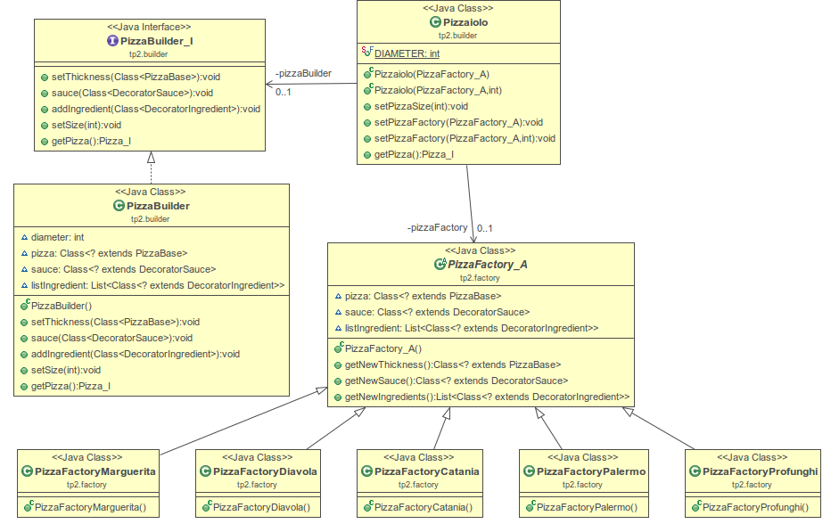

# TP3 - Rapport

## Introduction
Pour ce Travail Pratique, il a été demandé d'améliorer le TP n°2 afin d'ajouter une abstract factory pour la création de Pizza.

Une Factory pour divers types de pizza était demandée :
 - Catania
 - Margherita
 - Palerma
 - Profunghi

 Les décorateurs des ingrédients supplémentaires ont été rajoutés avant de commencer le travail sur les Factorys.


## Abstract factory
Abstract factory est un pattern qui permet de déléguer la construction d'objets complexes à une autre classe.

### Réalisation
Nous avons couplé l'implémentation de ce pattern avec le pattern Builder que nous avions implémenté lors du TP n°2. Ce guilder avait déjà été pensé afin de simplifier la création de pizza et nécessitait qu’on lui passe des "Classes" et non pas des objets.

Notre abstract factory est très bien intégré au `Builder` ainsi, pour créer une pizza, il suffit d'hériter de la classe `PizzaFactory_I` et de définir le type de pâte, la sauce et de spécifier la liste des ingrédients que contiendra la pizza.

#### Exemple de code
Voici le code de l'`Abstract Factory`, son fonctionnement est très simple.

```java
public abstract class PizzaFactory_A {

 public PizzaFactory_A() {
  listIngredient = new ArrayList<>();
 }

 public Class<? extends PizzaBase> getNewThickness(){
  return pizza;
 }

 public Class<? extends DecoratorSauce> getNewSauce(){
  return sauce;
 }

 public List<Class<? extends DecoratorIngredient>> getNewIngredients(){
  return listIngredient;
 }

 Class<? extends PizzaBase> pizza;
 Class<? extends DecoratorSauce> sauce;
 List<Class<? extends DecoratorIngredient>> listIngredient;
}
```

Voici l'implémentation d'une `concrete factory`, dans ce cas Margherita.

```Java
public class PizzaFactoryMargherita extends PizzaFactory_A{

 public PizzaFactoryMargherita() {
  super();
  this.pizza = PizzaThin.class;
  this.sauce = DecoratorTomato.class;
  this.listIngredient.add(DecoratorMozzarella.class);
  this.listIngredient.add(DecoratorOregano.class);
 }
}
```

#### Diagramme de classe



### Conclusion
L'objectif est atteint. A l'aide de ce patron, nous avons la possibilité de passer une factory à notre "Pizzaiolo" qui va l'utiliser afin de réaliser de nouvelles pizzas.
Ce patron s'avère très utile, car il permet de simplifier le code du client qui va utiliser notre code pour la création de pizza, il n'a plus à se soucier de comment la Pizza doit être créée ni de son implémentation.
